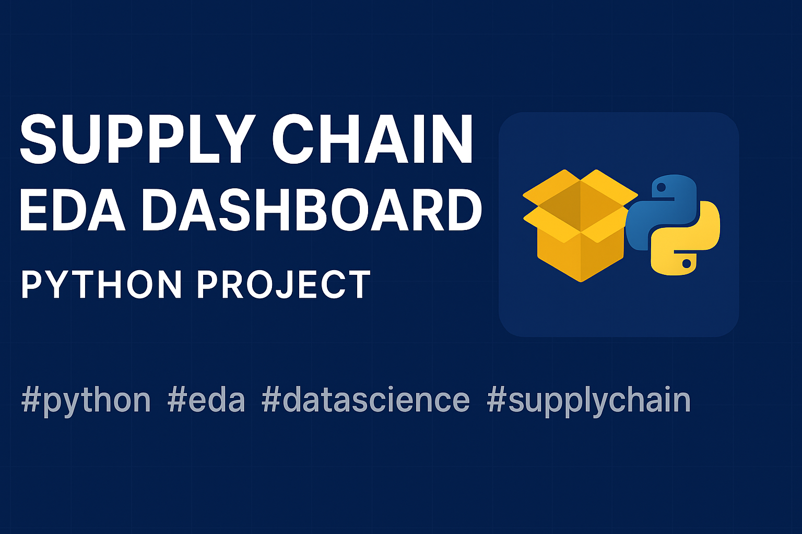
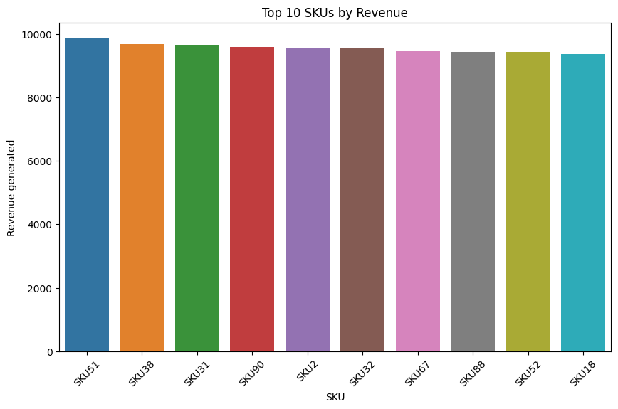
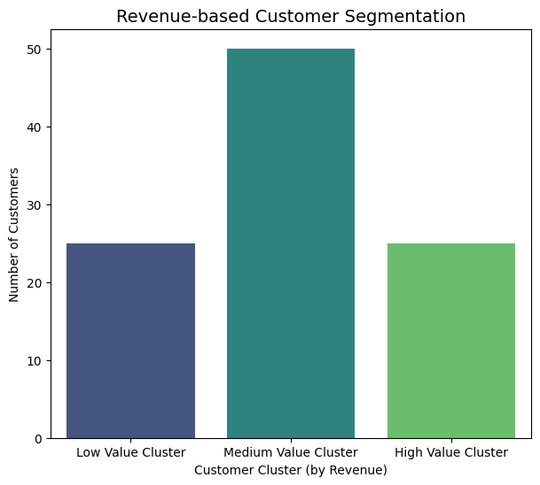
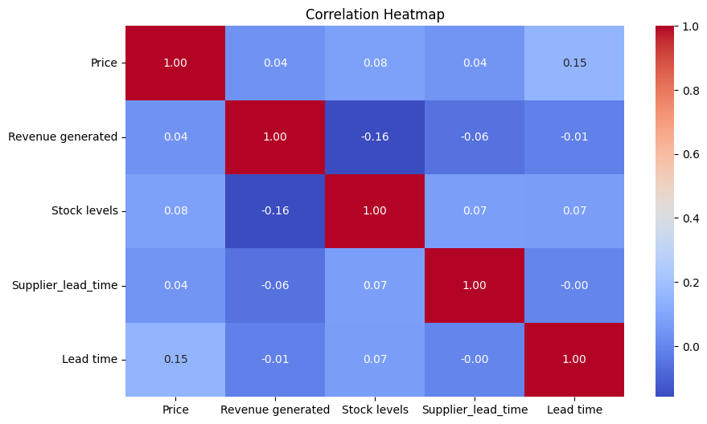
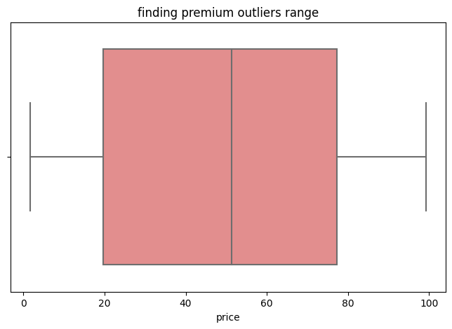

# 📦 Supply Chain Management — EDA


<p align="center">
  
  
  
  
  
</p>

<p align="center">
  <a href="https://github.com/dubeypt/supply-chain-eda">
    
    
    
    
    
  </a>
</p>

## Overview
This project performs Exploratory Data Analysis (EDA) on a sample supply chain dataset to uncover insights about bottlenecks, supplier performance, shipment delays, and cost trends. The analysis helps in optimizing inventory and improving overall supply chain efficiency.

## Project Objective
- Understand key supply chain metrics and their distributions
- Identify delays, bottlenecks, and patterns in shipments
- Derive actionable insights for better decision-making

## Dataset
- Sample supply chain dataset containing:
  - Orders, Shipments, Suppliers
  - Costs, Delivery timelines, Inventory levels
- Cleaned and preprocessed for analysis

## Tools & Libraries
- **Python**
- **Pandas** — Data manipulation & cleaning
- **NumPy** — Numerical computations
- **Matplotlib & Seaborn** — Data visualization
- **Jupyter Notebook** — Interactive development

## Highlights
- Data cleaning & preprocessing
- Visualizations for:
  - Order distribution
  - Shipment delays
  - Supplier performance
  - Cost trends
- Actionable insights to reduce delays and optimize inventory

## Key Visual Insights







**Summary:**  
This EDA highlights top-selling products, customer segments, supplier performance, and cost-efficiency insights.

## 📊 Conclusion
This EDA provided actionable insights into supplier performance, shipment delays, cost optimization, and revenue trends.
The analysis can help organizations improve demand forecasting and reduce logistics inefficiencies.

## How to Run
```bash
git clone https://github.com/dubeypt/supply-chain-eda.git
cd supply-chain-eda
python -m venv venv
source venv/bin/activate   # On Windows use: venv\Scripts\activate
pip install -r requirements.txt
jupyter lab
```

**Author:** [Aditya Dubey](https://github.com/dubeypt)  
*Data Science | Analytics | AI And ML Enthusiast*

